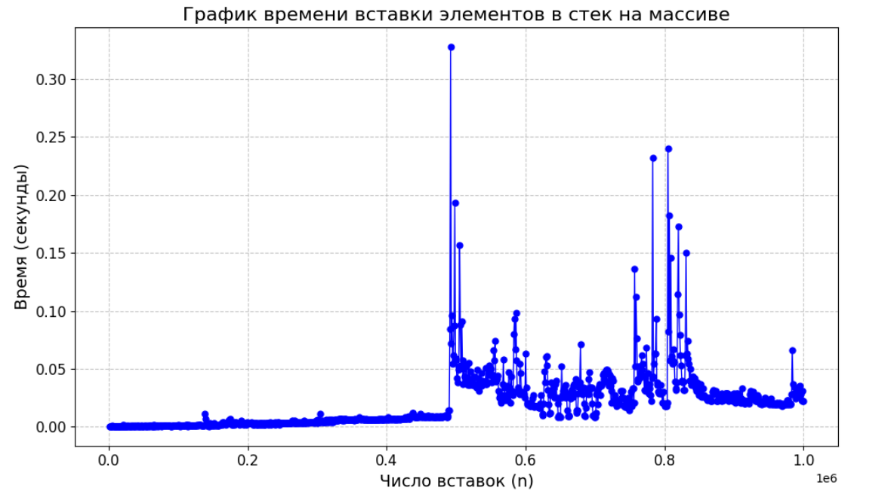
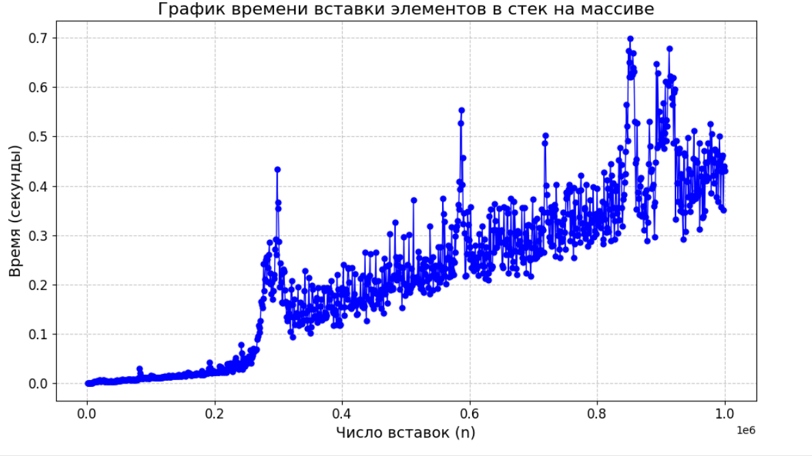

# Сравнение стеков
## Практическая работа 2. "Сравнение скорости работы динамического массива и односвязного списка" 
[ссылка на задание](https://github.com/VTroyanGolovyan/MiptAaDS/blob/main/2024/Labs/Lab2Stacks/README.md)

Все тесты кроме 4 проверялись на 100 тестах
| № теста | Стек на массиве | Стек на списке |
|---------|------------------|----------------|
|   1     |   0.01375        |   0.40231      |
|   2     |   0.03511        |   0.97696      |
|   3     |   0.2018         |   0.20334      |
|   4     |   0.02167        |   0.16476      |

***Tест 4:***\
Динамика: \

Список: \

*Примечание: оба графика были построены с помощью кода на python (см файл plot.ipynb)* 

***Вывод***\
Я получил, что стек на динамическом массиве работает быстрее стека на списке. Это происходит по нескольким причинам:
1) *Локальность памяти:* Динамический стек реализован с использованием массива, поэтому все элементы располагаются в памяти последовательно. В стеке на списке они расположены в произвольном порядке. Компьютеру быстрее брать элементы памяти, расположенные последовательно, нежели в произвольном порядке. Из-за этого динамика работает быстрее списка.
2) *Меньшее количество аллокаций:* В динамическом стеке аллокации используются довольно редко, тем более на больших числах. К примеру, после 1е6 операций push мы перевыделим память всего 20 раз. Но в стеке на списке каждая операция push выделяет память. Из-за этого стек на списке работает дольше.
3) *Простота операций:* В динамическом стеке push и pop никак не затрагивают память (за исключением расширения/сужения). В стеке на списках она затрагивается каждый раз, поэтому этот тип стека работает дольше.
