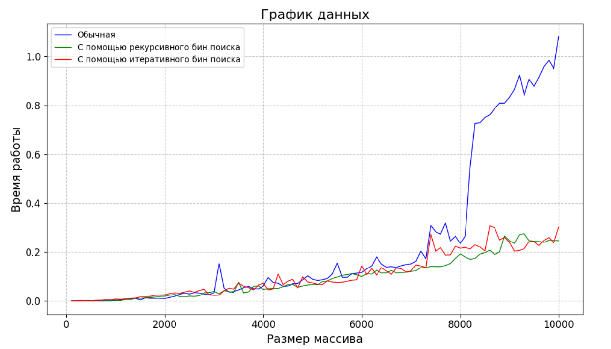
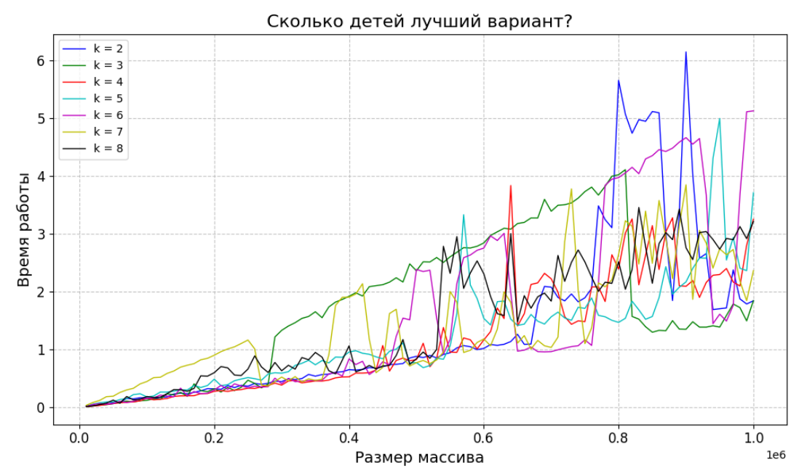
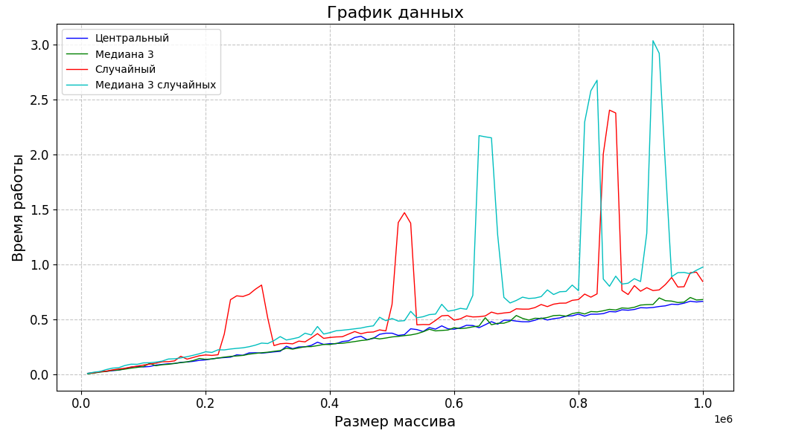

# Cравнение сортировок
## Пункт 1. Квадратичные (и не совсем) сортировки
Посмотрим на 4 графика сортировок:

Быстрее всех отработала сортировка вставками

Оптимизируем сортировку вставками с помощью бинарного поиска и прогоним её на массивах от 100 до 10000 с шагом 100. 

Стандартная сортировка вставками проходит по всем элементам массива и вставляет каждый элемент на правильное место среди уже отсортированных элементов. Для этого она сравнивает текущий элемент с предыдущими элементами, пока не найдет место для вставки.

Сортировка вставками с использованием бинарного поиска для нахождения места вставки уменьшает количество сравнений, которые выполняются во время прохода по массиву. Вместо линейного поиска места вставки сортировка вставками с бинарным поиском использует бинарный поиск для нахождения места вставки, что уменьшает количество сравнений до логарифмического времени поиска.

Таким образом, сортировка вставками с использованием бинарного поиска работает быстрее стандартной сортировки вставками особенно на больших массивах.

## Пункт 2. Пирамидальная сортировка

Отсюда видно что 5 детей - лучший вариант 

Построение кучи за O(n):

1) Начнем с последнего уровня дерева и будем перемещаться к корню.
2) Для каждого узла, начиная с последнего уровня и двигаясь к корню, выполним процедуру называемую "просеиванием вниз" (siftDown). Эта процедура гарантирует, что узел и его дочерние узлы удовлетворяют свойству кучи.
3) Повторим шаг 2 для всех узлов дерева. 

Мы получим кучу, так как до вызова siftDown для вершины, ее поддеревья являются кучами. После выполнения siftDown эта вершина с ее поддеревьями будут также являться кучей. Значит, после выполнения всех siftDown получится куча.

Докажем, почему построение работает именно за O(n): 

На предпоследнем ярусе элементов не более, чем n/4. При этом элементы могут опуститься не более чем на 1.
$$
T(n) = \sum_{i = 1}^h \frac{n}{2^{i+1}} = O(n) \sum_{i = 1}^h \frac{i}{2^{i}} = O(n) \sum_{i = 1}^h \frac{1}{2} * \frac{i-1}{2^{i-1}} + \frac{1}{2^{i}}
$$

Заметим, что сумма ограничена константой, поэтому T(n) = O(n)

## Пункт 3. Сортировка слиянием. Пирамидальная сортировка

Мы видим, что рекурсивная версия работает быстрее

## Пункт 4. Быстрые сортировки (партиционирования и оптимизации)

Из графика следует, что всех числах Хуар быстрее.

## Пункт 5. Быстрые сортировки (разные стратегии выбора, прочее)

Мы видим, что центральный элемент и медиана 3 - лучший вариант для пивота. Случайные элементы не очень хороший вариант, тк они могут долго работать на не очень больших тестах (когда нам не везёт).

## Пункт 8. Сортировки, основанные не на сравнениях

Из графика видно, что MSD работает быстрее

