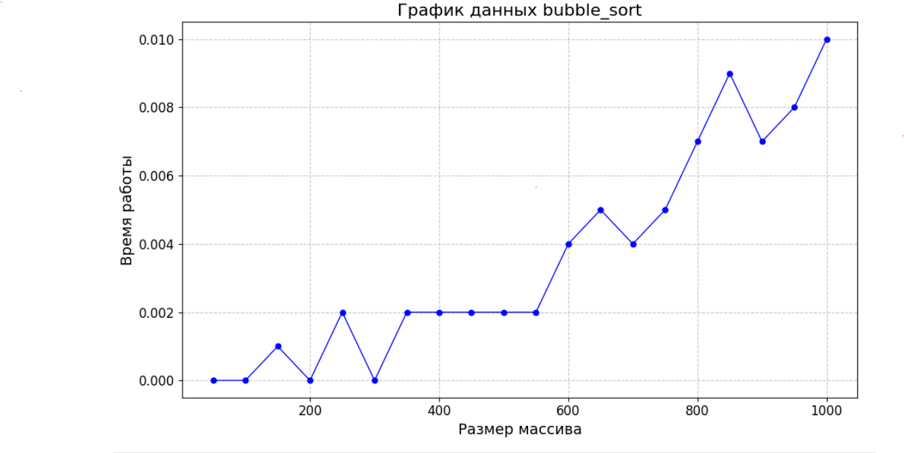
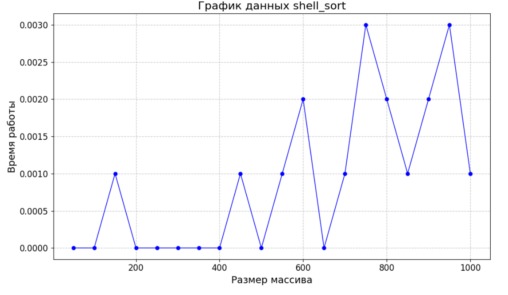
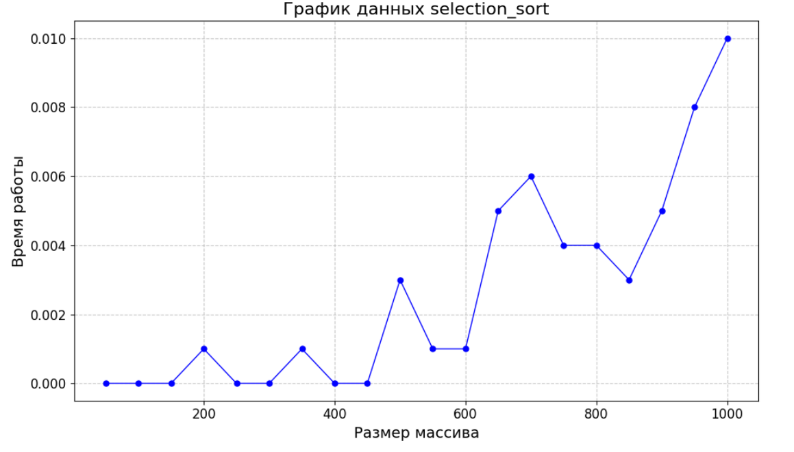
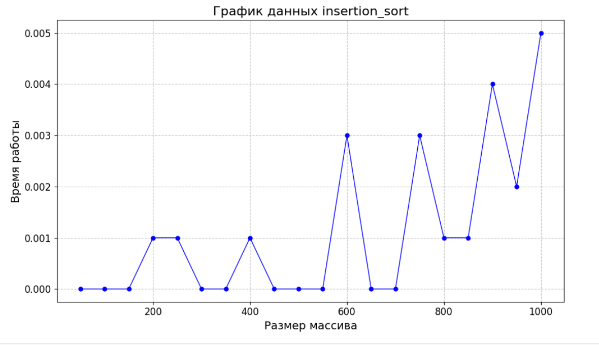
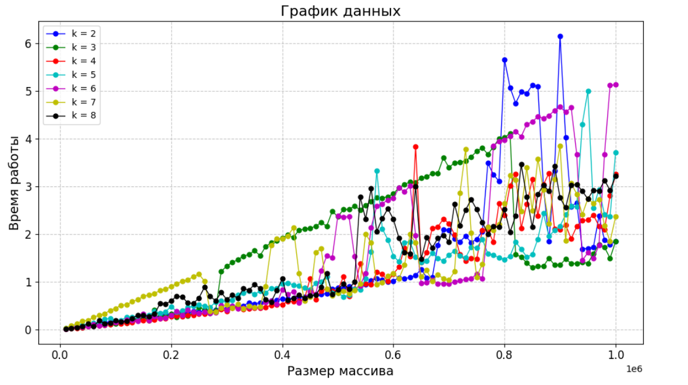
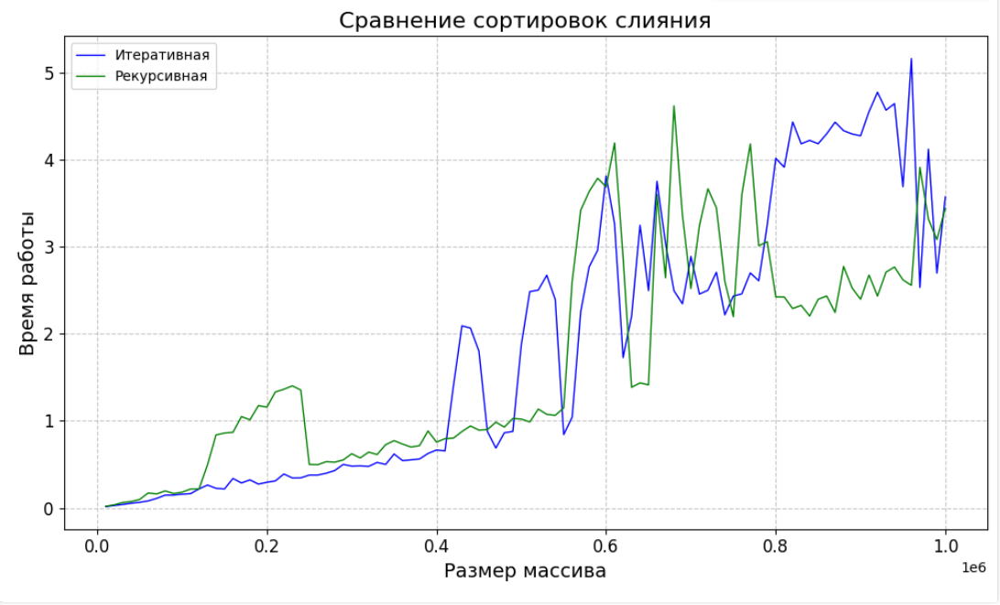
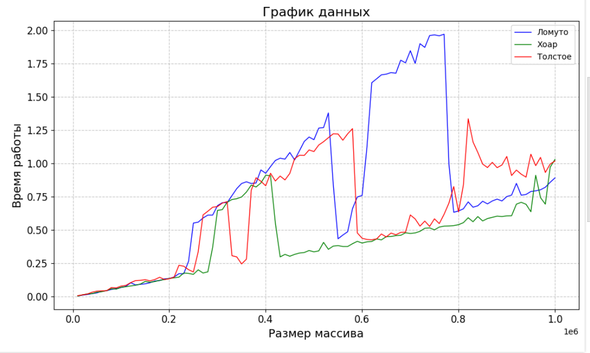
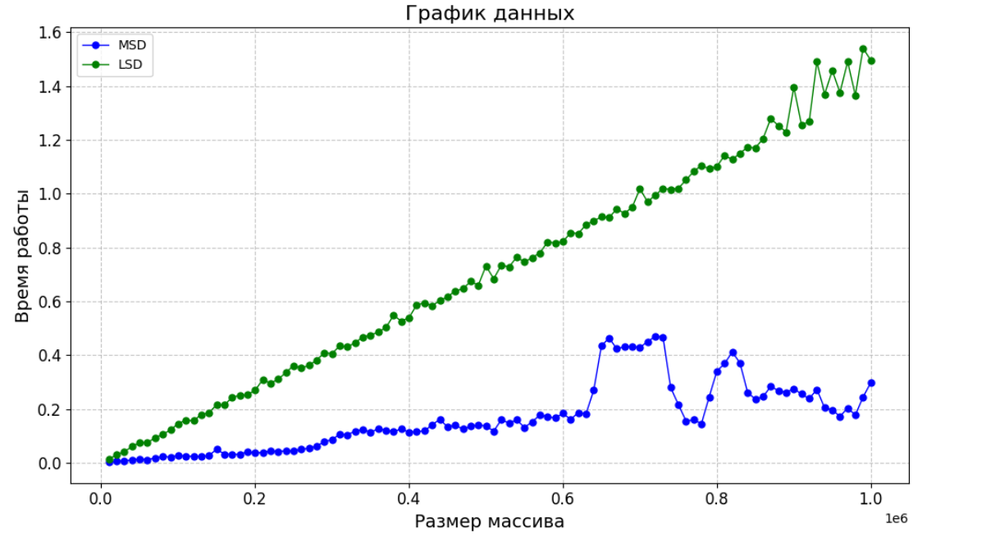

# Cравнение сортировок
## Пункт 1. Квадратичные (и не совсем) сортировки
Посмотрим на 4 графика сортировок:

Быстрее всех отработала сортировка вставками

## Пункт 2. Пирамидальная сортировка

Отсюда видно что 5 детей - лучший вариант 

Построение кучи за O(n):

1) Начнем с последнего уровня дерева и будем перемещаться к корню.
2) Для каждого узла, начиная с последнего уровня и двигаясь к корню, выполним процедуру называемую "просеиванием вниз" (siftDown). Эта процедура гарантирует, что узел и его дочерние узлы удовлетворяют свойству кучи.
3) Повторим шаг 2 для всех узлов дерева. 

Мы получим кучу, так как до вызова siftDown для вершины, ее поддеревья являются кучами. После выполнения siftDown эта вершина с ее поддеревьями будут также являться кучей. Значит, после выполнения всех siftDown получится куча.

## Пункт 3. Сортировка слиянием. Пирамидальная сортировка

Мы видим, что рекурсивная версия работает быстрее

## Пункт 4. Быстрые сортировки (партиционирования и оптимизации)

Из графика следует, что всех числах Хуар быстрее.

## Пункт 8. Сортировки, основанные не на сравнениях

Из графика видно, что MSD работает быстрее

